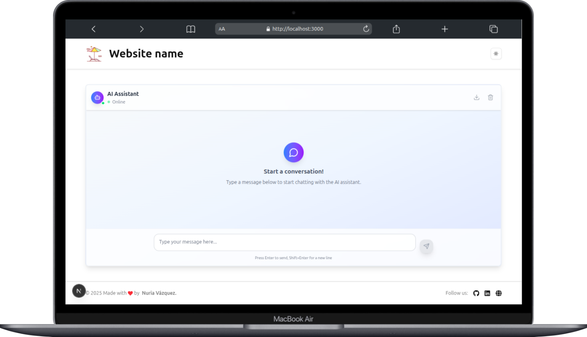
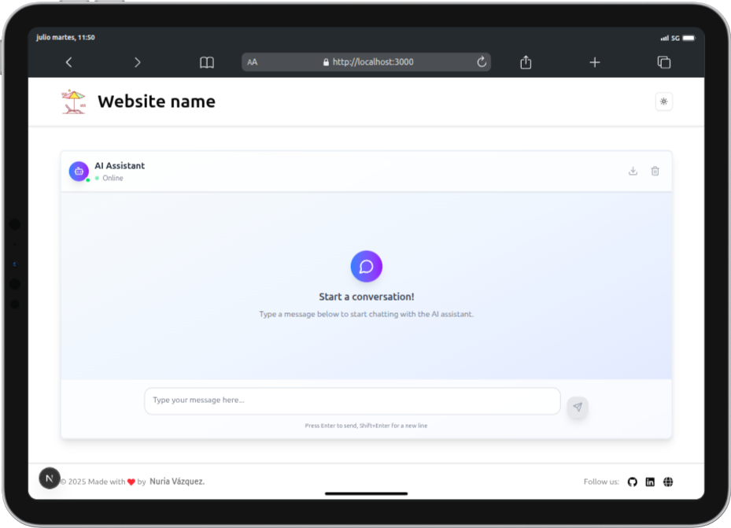
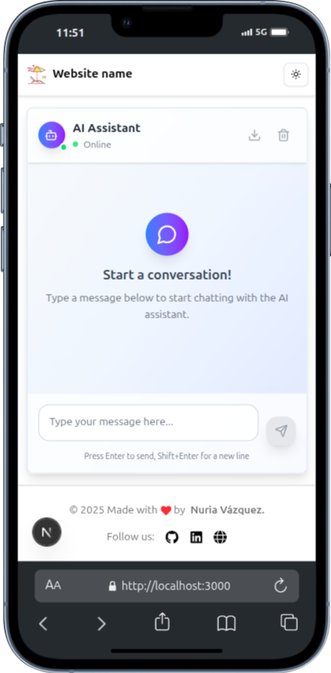

# Sistema de Chat IA

## 🚀 Descripción del Proyecto
Una aplicación completa full-stack de chat con integración de inteligencia artificial. Este proyecto consiste en un backend con FastAPI y un frontend en React y Next.js que trabajan juntos para proporcionar una experiencia de chat interactiva con IA.

[](https://fastapi.tiangolo.com/) [](https://reactjs.org/)

 [](https://nextjs.org/)

 [](https://platform.openai.com/) [](https://www.python.org/) [](https://www.typescriptlang.org/)


## Características

-   **Chat IA en tiempo real**: Respuestas instantáneas del modelo de lenguaje de OpenAI.
-   **UI**: Interfaz responsiva basada en React y Next.js.
-   **API RESTful**: Backend con FastAPI y endpoints.
-   **Multiplataforma**: Funciona en escritorio, tablet y dispositivos móviles
-   **Arquitectura escalable**: Construido con la intención de que sea un proyecto escalable.

## 📁 Estructura del Proyecto

```
ai-chat-system/
├── backend-chat/              # Aplicación backend con FastAPI
│   ├── app/                   # Código de la aplicación
│   │   ├─── api/              # Definición de rutas y controladores
│   │   │   ├─── routes/       # Submódulos de rutas organizadas por funcionalidad
│   │   │   │   ├─── ai/       # Rutas relacionadas con la IA
│   │   │   │   ├─── public/   # Rutas públicas sin autenticación
│   │   ├─── config/           # Configuración general del sistema
│   │   ├─── constants/        # Variables constantes 
│   │   ├─── models/           # Modelos de datos 
│   │   ├─── responses/        # Estructuras de respuesta 
│   │   ├─── services/         # Lógica de negocio y servicios externos
│   │   ├─── utils/            # Funciones auxiliares y utilitarias
│   │   ├── main.py            # Punto de entrada de la aplicación
│   ├── .env                   # Variables de entorno
│   ├── tests/                 # Pruebas unitarias y de integración
│   ├── requirements.txt       # Dependencias de Python
│   ├── README.md              # Documentación específica del backend en inglés
│   ├── README.es.md           # Documentación específica del backend en español
│
├── frontend-chat/             # Aplicación frontend con React
│   ├── src/                   # Código fuente
│   │   ├─── app/              # Configuración principal y enrutamiento
│   │   ├─── components/       # Componentes reutilizables de la interfaz
│   │   ├─── constants/        # Constantes globales de frontend 
│   │   ├─── hooks/            # Hooks 
│   │   ├─── lib/              # Librerías y utilidades auxiliares
│   │   ├─── services/         # Funciones para interactuar con APIs
│   │   ├─── styles/           # Estilos globales 
│   │   ├─── types/            # Definiciones de tipos y modelos TypeScript
│   │   ├── __tests__/         # Pruebas unitarias del frontend con jest
│   ├── package.json           # Dependencias de Node.js
│   ├── README.md              # Documentación específica del frontend
│   └── ...
│   ├── README.md              # Documentación específica del backend en inglés
│   ├── README.es.md           # Documentación específica del backend en 
└── .gitignore                 # Archivos y carpetas ignorados por Git


```

## 🛠️ Tecnologías

### Backend

-   **FastAPI**: Framework web de Python de alto rendimiento
-   **OpenAI API**: Integración con modelos de lenguaje de IA
-   **Python 3.13.3**: Runtime de Python más reciente
-   **CORS Middleware**: Manejo de solicitudes entre dominios

### Frontend

-   **React**: Biblioteca de JavaScript para construir interfaces
-  **Next.js**: Framework de React para aplicaciones web modernas.
-   **TypeScript**: Desarrollo de JavaScript.
-   **Tailwind**: Estilos moderno y diseño responsivo.

## 🚀 Inicio Rápido

### Prerrequisitos

-   Python 3.13+ instalado
-   Node.js 18+ y npm instalados
-   Clave API de OpenAI

### 1. Clonar el Repositorio

```bash
git clone https://github.com/nuriadevs/ai-chat-system.git
cd ai-chat-system
```

### 2. Configuración del Backend

```bash
cd backend-chat
pip install -r requirements.txt

# Crear archivo .env con tu clave API de OpenAI
OPENAI_API_KEY="tu_clave_api_openai_aqui"

# Iniciar el servidor backend
uvicorn app.main:app --reload --port 8000

```

El backend estará ejecutándose en `http://localhost:8000`

### 3. Configuración del Frontend

```bash
cd frontend-chat
npm install

# Iniciar el servidor de desarrollo
npm start

```

El frontend estará ejecutándose en `http://localhost:3000`

### 4. Acceder a la Aplicación

¡Abre tu navegador y navega a `http://localhost:3000` para comenzar a chatear con la IA!

## 📚 Documentación

Para instrucciones de configuración detalladas y documentación de la API, consulta los archivos README individuales:

-   **Documentación del Backend**:
-   **Documentación del Frontend**:

## 🧪 Pruebas

### Pruebas del Backend

```bash
cd backend-chat
pytest
```

### Pruebas del Frontend

```bash
cd frontend-chat
npm test
```

## 🌐 Endpoints de la API

-   `GET /`: Endpoint de verificación de salud
-   `POST /chat`: Enviar mensajes a la IA y recibir respuestas

Para la documentación completa de la API, visita `http://localhost:8000/docs` cuando el backend esté ejecutándose.

## 📱 Capturas de pantalla

  

### Escritorio

  



  
  

### Tablet

  



  

### Móvil

  




## 🤝 Contribuir

1.  Haz fork del repositorio
2.  Crea una rama de características (`git checkout -b feature/category-new`)
3.  Confirma tus cambios (`git commit -m 'Agregar alguna característica nueva'`)
4.  Empuja a la rama (`git push origin feature/category-new`)
5.  Abre un Pull Request


## 🔗 Enlaces

- [OpenAI](https://platform.openai.com/docs/overview)

- [OpenAI-Python](https://github.com/openai/openai-python)

- [FastApi](https://fastapi.tiangolo.com/)
- [Next.js](https://nextjs.org/)
- [Tailwind](https://tailwindcss.com/)
- [Shadcn](https://ui.shadcn.com/docs/dark-mode/next)


## 📬 Contacto

Si tienes alguna pregunta, sugerencia o propuesta de colaboración, no dudes en contactarme a través de mis redes sociales.

### ¡Gracias por visitar este repositorio y darle una estrella! 🚀