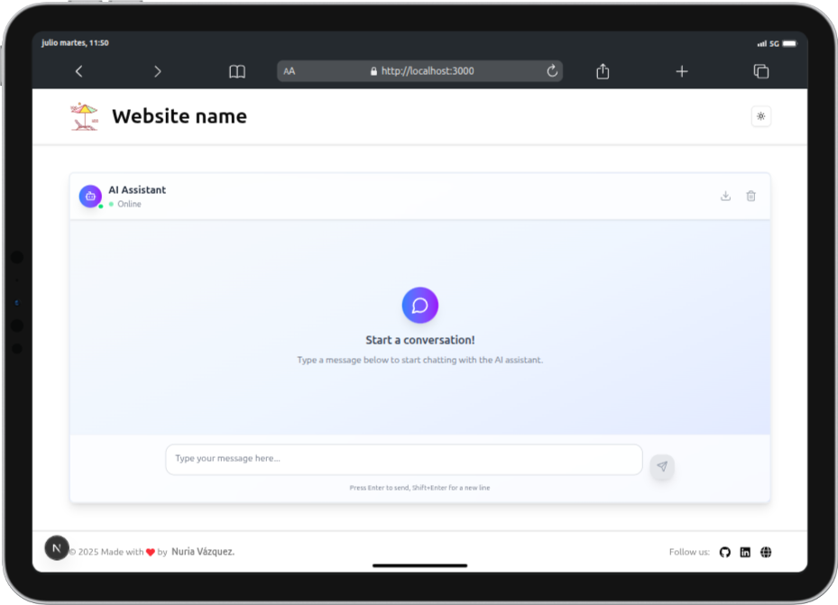

  

# AI Chat System

  

📘 README available in [Spanish](./README.es.md)

  

## 🚀 Project Description

  

A complete full-stack chat application with artificial intelligence integration. This project consists of a backend with FastAPI and a frontend in React and Next.js that work together to provide an interactive chat experience with AI.

  

[](https://fastapi.tiangolo.com/) [](https://reactjs.org/)

  

[](https://nextjs.org/)

  

[](https://platform.openai.com/) [](https://www.python.org/) [](https://www.typescriptlang.org/)

  

## Features

  

-  **Real-time AI Chat**: Instant responses from OpenAI's language model.

-  **Responsive UI**: Responsive interface based on React and Next.js.

-  **RESTful API**: Backend with FastAPI and endpoints.

-  **Cross-platform**: Works on desktop, tablet, and mobile devices

-  **Scalable Architecture**: Built with the intention of being a scalable project.

  

## 📁 Project Structure

  

```

ai-chat-system/

├── backend-chat/ # Backend application with FastAPI

│ ├── app/ # Application code

│ │ ├─── api/ # Route and controller definitions

│ │ │ ├─── routes/ # Route submodules organized by functionality

│ │ │ │ ├─── ai/ # AI-related routes

│ │ │ │ ├─── public/ # Public routes without authentication

│ │ ├─── config/ # System general configuration

│ │ ├─── constants/ # Constant variables

│ │ ├─── models/ # Data models

│ │ ├─── responses/ # Response structures

│ │ ├─── services/ # Business logic and external services

│ │ ├─── utils/ # Auxiliary and utility functions

│ │ ├── main.py # Application entry point

│ ├── .env # Environment variables

│ ├── tests/ # Unit and integration tests

│ ├── requirements.txt # Python dependencies

│ ├── README.md # Backend-specific documentation in English

│ ├── README.es.md # Backend-specific documentation in Spanish

│

├── frontend-chat/ # Frontend application with React

│ ├── src/ # Source code

│ │ ├─── app/ # Main configuration and routing

│ │ ├─── components/ # Reusable UI components

│ │ ├─── constants/ # Global frontend constants

│ │ ├─── hooks/ # Custom hooks

│ │ ├─── lib/ # Auxiliary libraries and utilities

│ │ ├─── services/ # Functions to interact with APIs

│ │ ├─── styles/ # Global styles

│ │ ├─── types/ # TypeScript type definitions and models

│ │ ├── __tests__/ # Frontend unit tests with jest

│ ├── package.json # Node.js dependencies

│ ├── README.md # Frontend-specific documentation

│ └── ...

│ ├── README.md # Backend-specific documentation in English

│ ├── README.es.md # Backend-specific documentation in Spanish

└── .gitignore # Files and folders ignored by Git

  

```

  

## 🛠️ Technologies

  

### Backend

  

-  **FastAPI**: High-performance Python web framework

-  **OpenAI API**: Integration with AI language models

-  **Python 3.13.3**: Latest Python runtime

-  **CORS Middleware**: Cross-domain request handling

  

### Frontend

  

-  **React**: JavaScript library for building user interfaces

-  **Next.js**: React framework for modern web applications.

-  **TypeScript**: JavaScript development with type safety.

-  **Tailwind**: Modern styling and responsive design.

  

## 🚀 Quick Start

  

### Prerequisites

  

- Python 3.13+ installed

- Node.js 18+ and npm installed

- OpenAI API key

  

### 1. Clone the Repository

  

```bash

git  clone  https://github.com/nuriadevs/ai-chat-system.git

cd  ai-chat-system

```

  

### 2. Backend Setup

  

```bash

cd  backend-chat

pip  install  -r  requirements.txt

  

# Create .env file with your OpenAI API key

OPENAI_API_KEY="your_openai_api_key_here"

  

# Start the backend server

uvicorn  app.main:app  --reload  --port  8000

  

```

  

The backend will be running at `http://localhost:8000`

  

### 3. Frontend Setup

  

```bash

cd  frontend-chat

npm  install

  

# Start the development server

npm  start

```

  

The frontend will be running at `http://localhost:3000`

  

### 4. Access the Application

  

Open your browser and navigate to `http://localhost:3000` to start chatting with the AI!

  

## 📚 Documentation

  

For detailed setup instructions and API documentation, check the individual README files:

  

-  **Backend Documentation**:

-  **Frontend Documentation**:

  

## 🧪 Testing

  

### Backend Tests

  

```bash

cd  backend-chat

pytest

```

  

### Frontend Tests

  

```bash

cd  frontend-chat

npm  test

```

  

## 🌐 API Endpoints

  

-  `GET /`: Health check endpoint

-  `POST /chat`: Send messages to AI and receive responses

  

For complete API documentation, visit `http://localhost:8000/docs` when the backend is running.

  

## 📱 Screenshots

  

### Desktop

  


  
  

### Tablet

  



  

### Mobile

  


  

## 🤝 Contributing

  

1. Fork the repository

2. Create a feature branch (`git checkout -b feature/category-new`)

3. Commit your changes (`git commit -m 'Add some new feature'`)

4. Push to the branch (`git push origin feature/category-new`)

5. Open a Pull Request

  

## 🔗 Links

  

- [OpenAI](https://platform.openai.com/docs/overview)

- [OpenAI-Python](https://github.com/openai/openai-python)

- [FastApi](https://fastapi.tiangolo.com/)

- [Next.js](https://nextjs.org/)

- [Tailwind](https://tailwindcss.com/)

- [Shadcn](https://ui.shadcn.com/docs/dark-mode/next)

  

## 📬 Contact

  

If you have any questions, suggestions, or collaboration proposals, don't hesitate to contact me through my social networks.

  

### Thank you for visiting this repository and giving it a star! 🚀